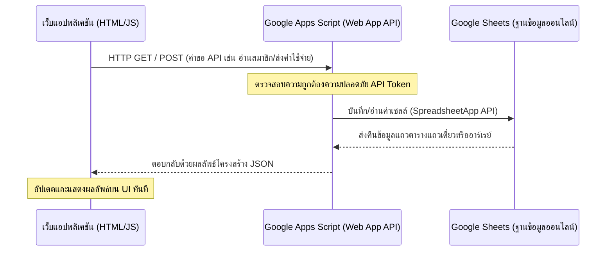

# คู่มือระบบงานทะเบียนสมาชิกและสวัสดิการ - ชมรมเพื่อน พ.น.

ระบบงานทะเบียนสมาชิกและสวัสดิการนี้ได้รับการออกแบบขึ้นเพื่อเป็นฐานข้อมูลกลางแบบออนไลน์สำหรับ **ชมรมเพื่อน พ.น.** เพื่อแก้ไขปัญหาการกระจัดกระจายของข้อมูลสมาชิกและอาจารย์ รวมถึงป้องกันความผิดพลาดในการคำนวณสิทธิ์สวัสดิการและการค้างชำระค่าบำรุง โดยระบบต้นแบบนี้เป็น **Single Page Application (SPA)** ที่ทำงานบนเบราว์เซอร์ได้อย่างสมบูรณ์

---

## 1. คุณสมบัติหลักของระบบ (System Features)

1. **ระบบทะเบียนสมาชิกออนไลน์**: บันทึกข้อมูลละเอียดครบถ้วน (รหัสสมาชิก, รุ่น, ชื่อเล่น, วันที่สมัคร, เบอร์โทร, ไลน์, เฟซบุ๊ก, ที่อยู่จัดส่งเอกสาร, ข้อมูลการศึกษา, และผู้ติดต่อฉุกเฉิน) พร้อมการใส่ภาพโปรไฟล์ส่วนตัว
2. **ระบบทะเบียนประวัติอาจารย์**: ติดตามสถานะของอาจารย์ (ปัจจุบันยังสอน / เกษียณอายุ / ถึงแก่กรรม)
3. **ระบบตรวจสอบค่าบำรุงอัตโนมัติ**: จัดเก็บประวัติการชำระเงินค่าบำรุงรายปี (ปีละ 300 บาท) พร้อมรายการแยกผู้ค้างชำระเงินตามจำนวนวันแบบเรียลไทม์
4. **เอนจินประมวลผลสถานะอัตโนมัติ (หัวใจของระบบ)**: ระบบจะประเมินสถานะของสมาชิกตามวันที่ของระบบโดยเปรียบเทียบกับประวัติชำระเงินงวดล่าสุด ดังนี้:
   * **Active New**: สมาชิกใหม่ที่สมัครเข้าชมรม (ต้องรอระยะเวลาอนุมัติสิทธิ์ 90 วันทั่วไป หรือ 30 วันกรณีสมัครใหม่หลังสิ้นสภาพ)
   * **Active**: สมาชิกที่ต่ออายุค่าบำรุงประจำปีตรงเวลา มีสิทธิ์ขอรับสวัสดิการเต็มจำนวน
   * **Active (Grace Period)**: เลยกำหนดต่ออายุไม่เกิน 30 วัน (ระบบอนุโลมให้รับสวัสดิการได้ต่อเนื่องชั่วคราว)
   * **Suspended**: ค้างชำระค่าบำรุง 31–90 วัน (ระงับสิทธิ์สวัสดิการชั่วคราว และจะคืนสิทธิ์ให้ทันทีเมื่อชำระค่าบำรุงเข้ามาในระบบ)
   * **Membership Terminated**: ขาดต่ออายุเกิน 90 วัน (สิ้นสภาพความเป็นสมาชิกโดยสมบูรณ์ หากต้องการกลับเข้าชมรมต้องสมัครใหม่และรอระยะเวลาพักสิทธิ์ 30 วัน)
5. **ระบบตรวจสอบสิทธิ์และทำเรื่องเบิกจ่ายสวัสดิการ**:
   * ตรวจสอบสิทธิ์ทางด้านการเงินและสิทธิ์ต่ออายุอัตโนมัติก่อนอนุมัติทำจ่ายสวัสดิการ
   * จำกัดวงเงินและจำนวนครั้งที่ขอเบิกต่อปีปฏิทินแบบเรียลไทม์ (ป้องกันการจ่ายเงินซ้ำซ้อนหรือเกินสิทธิ์)
6. **แผงควบคุม Dashboard & สรุปภาพรวม**: แสดงยอดจำนวนสมาชิกแยกสถานะ ค้างชำระ ยอดค่าใช้จ่ายสวัสดิการสะสม และระบบเตือนภัยด่วนอัตโนมัติเมื่อพบสมาชิกค้างชำระเงินเลยกำหนดเกณฑ์
7. **ระบบพิมพ์รายงานประจำปีสำหรับผู้บริหาร (PDF/Print)**: แยกสเปกตรัมพิมพ์ข้อมูลทะเบียนสมาชิก, ทะเบียนอาจารย์, รายงานค่าบำรุง, และรายงานการเบิกจ่ายสวัสดิการแยกประเภท

---

## 2. โครงสร้างไฟล์ในโครงการ

```
c:\Users\COM\OneDrive\เอกสาร\GitHub\bnccCLUB\
├── index.html                  # ไฟล์โครงสร้างหน้าจอหลักและฟอร์มทำงาน (HTML5)
├── css/
│   └── style.css               # สไตล์สีธีมมืดระดับพรีเมียม (CSS Variables & Responsive)
├── js/
│   ├── db.js                   # ตัวจัดการฐานข้อมูลจำลอง (localStorage) และข้อมูลเริ่มต้น (Seed Data)
│   ├── engine.js               # เอนจินคำนวณสถานะสมาชิกตามวันเวลาจำลอง และสิทธิ์สวัสดิการ
│   └── app.js                  # ตัวควบคุมพฤติกรรมหน้าจอ UI, สลับบทบาท, ฟอร์มบันทึกข้อมูล
└── README.md                   # เอกสารฉบับนี้
```

---

## 3. คู่มือการใช้งานสำหรับ 3 บทบาทหลัก

ระบบต้นแบบนี้มีแถบจำลองเครื่องมือด้านบน ประกอบด้วย:
* **วันที่จำลอง (System Date Traveler)**: เพื่อให้คุณสามารถย้อนเวลาหรือข้ามเวลาไปในอนาคต (เช่น ข้ามไป 6 เดือนข้างหน้า) เพื่อทดสอบการเปลี่ยนสถานะของสมาชิกและการแจ้งเตือนค้างชำระโดยอัตโนมัติของระบบ
* **สิทธิ์ผู้ใช้ (Role Selector)**: สำหรับสลับสิทธิ์การทดสอบงานระบบ 3 รูปแบบ

### บทบาทที่ 1: ผู้ดูแลทะเบียนสมาชิก (Member Admin)
* **การดำเนินการ**:
  1. เข้าสู่หน้าจอโดยเลือกบทบาทเป็น **"ผู้ดูแลทะเบียนสมาชิก"**
  2. ในหน้า **"ทะเบียนสมาชิก"** คุณสามารถคลิกปุ่ม **"+ เพิ่มสมาชิกใหม่"** หรือกดรูปปากกาเพื่อแก้ไขรายละเอียดสมาชิกได้
  3. ในหน้า **"ระบบค่าบำรุงสมาชิก"** คุณสามารถค้นหารายชื่อสมาชิกเพื่อทำการชำระเงิน และกดปุ่ม **"บันทึกรับเงิน"** ระบบจะเพิ่มระยะเวลาสมาชิกภาพออกไปอีก 1 ปีปฏิทินนับจากรอบการชำระ และแสดงประวัติการรับเงินด้านขวาในทันที

### บทบาทที่ 2: ผู้ดูแลสวัสดิการ (Welfare Admin)
* **การดำเนินการ**:
  1. สลับบทบาทด้านบนเป็น **"ผู้ดูแลสวัสดิการ"**
  2. ไปที่หน้าเมนู **"ระบบสวัสดิการ"**
  3. ในช่อง **"1. ค้นหาผู้รับสวัสดิการ"** ให้ป้อนตัวอักษรเพื่อค้นหาสมาชิกหรืออาจารย์ที่คุณต้องการช่วยเหลือ ระบบจะแสดงตัวเลือกการกดเลือก
  4. เมื่อเลือกผู้รับประโยชน์แล้ว ระบบจะประมวลผลและแสดงสถานะสมาชิกของผู้นั้นทันที
  5. เลือกประเภทสวัสดิการในหัวข้อ **"2. เลือกประเภทสวัสดิการ"**
     * ระบบจะดึงประวัติการเบิกของปีนี้ และทำการประเมินสิทธิ์แบบเรียลไทม์:
       * หากไม่พ้นระยะเวลาผ่อนผัน หรือโดนระงับสิทธิ์ หรือใช้สิทธิ์เกินโควต้าประจำปี ระบบจะขึ้นแถบแจ้งเตือนสีแดง และ**บล็อกไม่ให้ทำการบันทึก**
       * หากสิทธิ์สมบูรณ์ ระบบจะแสดงแถบสีเขียวพร้อมระบุวงเงินสูงสุดที่เบิกจ่ายได้
  6. กรอกจำนวนเงิน วันเกิดเหตุ รายละเอียดเพิ่มเติม และกดปุ่ม **"อนุมัติจ่ายและบันทึกรายการ"** ประวัติการเบิกจ่ายจะบันทึกเข้าสู่ระบบในช่องด้านล่างทันที

> [!IMPORTANT]
> **กรณีสมาชิกหรืออาจารย์ถึงแก่กรรม**
> เมื่อทำเรื่องเบิกจ่ายสวัสดิการประเภท "สมาชิกถึงแก่กรรม" หรือ "อาจารย์ถึงแก่กรรม" ระบบจะถามเพื่อความปลอดภัยในการอัปเดตสถานะของสมาชิก/อาจารย์ท่านนั้นเป็น **"ถึงแก่กรรม (Deceased)"** โดยตรง และจะปิดสิทธิ์การใช้ประโยชน์ด้านอื่นในระบบทันที

### บทบาทที่ 3: ผู้บริหาร/คณะกรรมการ (Executive/Committee)
* **การดำเนินการ**:
  1. สลับบทบาทเป็น **"ผู้บริหาร/คณะกรรมการ"**
  2. เข้าไปดูหน้า **"แผงควบคุม (Dashboard)"** เพื่อวิเคราะห์ข้อมูลเชิงลึกในรูปแบบแผนภูมิโดนัท และตรวจสอบรายการค้างชำระด่วนในชมรม
  3. เข้าไปหน้า **"รายงานประจำปี/พิมพ์"**
  4. เลือกแท็บประเภทรายงานที่ต้องการตรวจสอบ (ทะเบียนสมาชิก, ทะเบียนอาจารย์, รายงานค่าบำรุง, รายงานสวัสดิการ)
  5. กรองข้อมูลเฉพาะส่วนที่ต้องการวิเคราะห์ เช่น คัดเฉพาะรุ่น พ.น. หรือคัดเฉพาะสถานะปกติ
  6. กดปุ่ม **"พิมพ์รายงานนี้ (Print/PDF)"** ระบบจะทำลายแถบเมนูและส่วนที่ไม่เกี่ยวข้องในการพิมพ์ออกชั่วคราว เพื่อเตรียมหน้ากระดาษสีขาวตัวหนังสือสีดำให้เหมาะสำหรับการสั่งปริ้นท์เป็นแผ่นเอกสารหรือบันทึกเป็น PDF เพื่อส่งมอบในที่ประชุมประจำปีของชมรม

---

## 4. ตารางเปรียบเทียบโควต้าวงเงินสวัสดิการ

| ประเภทสวัสดิการ | สิทธิ์ผู้รับประโยชน์ | เพดานวงเงินช่วยเหลือ | ข้อจำกัดสิทธิ์ / โควต้าความถี่ |
| :--- | :--- | :--- | :--- |
| **ครอบครัวสมาชิกถึงแก่กรรม** | สมาชิกชมรม | ไม่เกิน 2,000 บาท | ตามเหตุการณ์ที่เกิดขึ้นจริง |
| **สมาชิกชมรมถึงแก่กรรม** | สมาชิกชมรม | 5,000 บาท | สูงสุด 1 ครั้ง (พร้อมเปลี่ยนสถานะเป็นถึงแก่กรรม) |
| **เยี่ยมไข้สมาชิกเจ็บป่วย** | สมาชิกชมรม (พักฟื้น 3 วันขึ้นไป) | ไม่เกิน 1,500 บาท / ครั้ง | สูงสุดไม่เกิน **2 ครั้ง / ปีปฏิทิน** |
| **อาจารย์ถึงแก่กรรม** | อาจารย์ชมรม | ไม่เกิน 2,000 บาท | สูงสุด 1 ครั้ง (พร้อมเปลี่ยนสถานะเป็นถึงแก่กรรม) |
| **เยี่ยมไข้อาจารย์เจ็บป่วย** | อาจารย์ชมรม (พักฟื้น 3 วันขึ้นไป) | ไม่เกิน 2,000 บาท / ครั้ง | สูงสุดไม่เกิน **1 ครั้ง / ปีปฏิทิน** |

---

## 5. การเปิดใช้งานและการจำลองข้อมูล (How to Run Locally)

1. ดาวน์โหลดหรือติดตั้งโฟลเดอร์โครงการลงบนเครื่องคอมพิวเตอร์ของคุณ
2. สามารถเปิดใช้งานหน้าเว็บหลักได้ทันทีโดยการ **ดับเบิลคลิกไฟล์ `index.html`** เพื่อทำงานผ่านบราวเซอร์ (เช่น Google Chrome, Microsoft Edge, Safari)
3. ระบบจะทำการเก็บประวัติการชำระเงินและการเบิกสวัสดิการทั้งหมดไว้ที่พื้นที่ข้อมูลสำรอง `localStorage` ของเบราว์เซอร์ ทำให้ข้อมูลที่คุณเพิ่มหรือแก้ไขจะไม่หายไปเมื่อปิดเว็บหรือทำการรีเฟรชหน้าจอ
4. หากคุณต้องการจัดการฐานข้อมูลทั้งหมด คุณสามารถเข้าไปที่เมนู **"ตั้งค่า & จัดการข้อมูล"** เพื่อ:
   * **ส่งออกข้อมูลดิบ (RAW JSON)**: นำออกไปเก็บบันทึกเป็นไฟล์สำรองลงในเครื่องคอมพิวเตอร์ของคุณ
   * **นำเข้าข้อมูล**: นำไฟล์สำรองข้อมูล JSON วางทับลงระบบเพื่อรันระบบต่อ
   * **ล้างข้อมูลกลับเป็นค่าเริ่มต้น**: คืนค่าฐานข้อมูลทั้งหมดกลับมาเป็นแบบข้อมูลจำลองตั้งต้น (Seed Data) เพื่อสาธิตและทดสอบฟังก์ชันใหม่อีกครั้ง

---

## 6. แนวทางสถาปัตยกรรมสำหรับต่อขยายขึ้นคลาวด์ (Cloud API Integration)

เมื่อคณะกรรมการพร้อมสำหรับเปลี่ยนผ่านฐานข้อมูลระบบนี้ขึ้นสู่ระบบอินเทอร์เน็ตผ่านคลาวด์ เพื่อให้สมาชิกหลายคนสามารถแก้ไขข้อมูลพร้อมกันได้แบบเรียลไทม์ตามเงื่อนไขข้อที่ 5 ในเอกสารความต้องการ สามารถดำเนินการเชื่อมต่อง่ายๆ ดังนี้:

### สถาปัตยกรรมการสื่อสารข้อมูล


### ตัวอย่าง Google Apps Script เบื้องต้นสำหรับรับค่าชำระเงินและสวัสดิการ
คุณสามารถนำสคริปต์นี้ไปเปิดสร้างบริการ Web App บนบัญชี Google Apps Script ของคุณ:

```javascript
function doGet(e) {
  var action = e.parameter.action;
  var sheet = SpreadsheetApp.getActiveSpreadsheet();
  
  if (action === "getMembers") {
    var dataSheet = sheet.getSheetByName("members");
    var rows = dataSheet.getDataRange().getValues();
    var headers = rows[0];
    var list = [];
    
    for (var i = 1; i < rows.length; i++) {
      var row = rows[i];
      var record = {};
      for (var j = 0; j < headers.length; j++) {
        record[headers[j]] = row[j];
      }
      list.push(record);
    }
    
    return ContentService.createTextOutput(JSON.stringify(list))
      .setMimeType(ContentService.MimeType.JSON);
  }
}

function doPost(e) {
  var params = JSON.parse(e.postData.contents);
  var action = params.action;
  var sheet = SpreadsheetApp.getActiveSpreadsheet();
  
  if (action === "recordPayment") {
    var feeSheet = sheet.getSheetByName("fees");
    feeSheet.appendRow([
      params.id,
      params.memberId,
      params.paymentDate,
      params.amount,
      params.year,
      params.recordedBy
    ]);
    
    // อัปเดตตารางหลักสมาชิก
    var memberSheet = sheet.getSheetByName("members");
    var membersData = memberSheet.getDataRange().getValues();
    for (var i = 1; i < membersData.length; i++) {
      if (membersData[i][0] === params.memberId) {
        memberSheet.getRange(i + 1, 15).setValue(params.paymentDate); // ช่อง lastPaymentDate
        break;
      }
    }
    
    return ContentService.createTextOutput(JSON.stringify({success: true}))
      .setMimeType(ContentService.MimeType.JSON);
  }
}
```
หลังจากตั้งค่า Deploy และคัดลอก **Web App URL** มาแล้ว ให้คุณแทนที่ฟังก์ชันอ่าน-เขียนข้อมูลใน `js/db.js` จากเดิมที่บันทึกลงเบราเซอร์มาเป็นการเรียก `fetch()` ไปยัง Web App URL ดังกล่าว ระบบก็จะเชื่อมต่อออนไลน์ได้อย่างสมบูรณ์แบบโดยไม่ต้องมีโฮสต์ฐานข้อมูลราคาแพง
